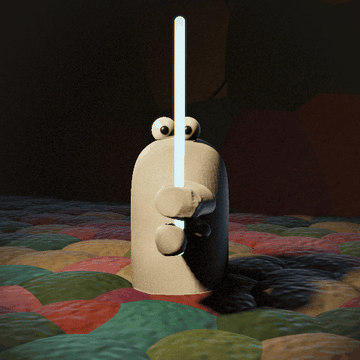

# clayfray

<p align="center"></p>

A 1v1 fighter where both players are clay that dents and slices for real.
Custom C++ engine: SDL3 + Dawn (WebGPU), whole scene is a sphere-traced SDF —
no triangle pipeline. Runs natively and **in a browser**, including on a phone.

Stop-motion is the art direction and the architecture: everything visible
moves on a **12 Hz pose grid**, which is also what makes frame reuse possible.

## Build & run

```sh
brew install cmake ninja ccache   # once
cmake -B build -G Ninja           # first configure fetches ~3GB of deps (Dawn)
cmake --build build
./build/clayfray                  # windowed
```

`WASD` walks (camera-relative), `SPACE` swings, `1/2/3` switch
orbit/carve/add, left-drag orbits, wheel zooms. Shaders in `shaders/`
hot-reload while it runs.

### Web

```sh
emcmake cmake -S . -B build-web -DCMAKE_BUILD_TYPE=Release
cmake --build build-web
tools/serve-web.sh          # localhost
tools/serve-web.sh tunnel   # public https — works from a phone over cellular
tools/serve-web.sh tls      # https on the LAN, iOS-compliant self-signed cert
```

**WebGPU needs a secure origin**, and a browser does not warn about this — it
omits `navigator.gpu` entirely, which looks exactly like "this browser has no
WebGPU". Only `localhost`, `127.0.0.1` and `https://` count, so a plain LAN
URL silently fails. `web/webgpu-check.html` is a standalone probe that touches
none of the wasm and tells the two cases apart.

The web build drops the dev tooling (ctl, snapshots, hot reload, headless
modes) behind `src/platform.h`; it keeps the renderer, the sim and the ImGui
panel.

## The character has no skeleton

`assets/fighter.glb` is three meshes with **no armature** — `body`, `hand`
(with a `grab` shape key) and `eye`. They become three disjoint "brushes" in
one volume, and articulation is:

- **body** — one affine matrix: squish, lean, hop, driven by a spring
- **hands** — one rigid transform each, right one mirrored, pose picked
  discretely (never interpolated — snapping is the stop-motion idiom)
- **eyes** — analytic beads; gaze rotates the pupil, no bones needed

That replaced a 13-piece per-sample inverse-LBS warp that was 65% of the
frame. Traced frame cost went **57.1 ms → ~22 ms** (17.5 → ~45 fps) at
640×360, and GPU memory **508 MB → 104 MB** for two fighters.

## Iterating

```sh
./build/clayfray --serve &                        # headless sim console
tools/ctl.sh "set look.aoStrength 0.8" stats      # live tuning, no rebuild
tools/ctl.sh "edit carve 0.02 0.42 0.12 0.07"     # scripted sculpt
```

```sh
./build/clayfray --res 640x360                    # PIN the traced resolution
tools/fairbench.sh "a:ENV=1" "b:" 3 8             # interleaved A/B benchmark
./build/clayfray --carve-test                     # exit 3 = clay leaked
```

`--res` exists because frame cost is per **traced pixel** and window size does
not tell you that — the startup `[res]` line always reports the truth.
`fairbench.sh` interleaves configs and takes medians because this hardware
drifts up to 2.8× under sustained load, which is larger than most effects
being measured.

Headless: `--screenshot PATH --size WxH --frames N --aa N`, `--cam AZ,EL,DIST`,
`--replay f.journal`, `--character file.glb`.

## Where things are written down

- **`CLAUDE.md`** — the traps that have each cost a debugging session, and the
  agent dev loop. Read before changing the renderer.
- **`PLAN.md`** — architecture and locked decisions.
- **`docs/claybook/`** — the GDC 2018 Claybook deck, the closest published
  prior art, plus what we took from it and the two techniques it lists as
  failed (which this codebase independently reproduced before finding them).
